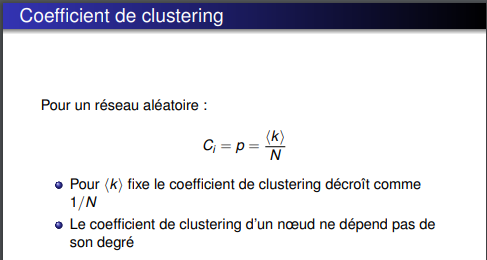
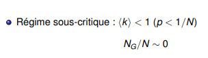

# TP Mesures sur les réseaux d'intéraction

***

# Rapport de BOURGEAUX Maxence, Groupe 1 Master IWOCS

***

## Introduction

Le but de ce TP est d'utiliser GraphStream afin de lire des données et d'analyser différents résultats comme la 
distribution des degrés, la distance moyenne ...

***

## Question 2. Prenez quelques mesures de base: nombre de nœuds et de liens, degré moyen, coefficient de clustering. Quel sera le coefficient de clustering pour un réseau aléatoire de la même taille et du même degré moyen ?

L'utilisation de méthodes déjà implémentées par GraphStream nous permet de prendre quelques mesures de base:
* Nombre de noeuds: 317080
* Nombre de liens: 1049866
* Degré moyen: 6.62208890914917
* Coefficient de clustering: 0.6324308280637396

Voici la formule pour calculer le coefficient de clustering pour un réseau aléatoire:

Ce qui nous donne: p = 6.62208890914917 / 317 080 = 2,0884599814397533745427021571843e-5.

***

## Question 3. Le réseau est-il connexe ? Un réseau aléatoire de la même taille et degré moyen sera-t-il connexe ? À partir de quel degré moyen un réseau aléatoire avec cette taille devient connexe ?

Avec la méthode isConnected() de GraphStream, on peut facilement savoir si un réseau est connexe ou non. Le résultat obtenu
nous retourne true, il est donc bien connexe.

Pour trouver si un réseau aléatoire de la même taille et degré moyen est connexe, on utilise la formule suivante:  

D'où ln(317080) = 12.67.

Un réseau aléatoire devient donc connexe à partir d'un degré moyen supérieur ou égal à 12.67, ce qui correspond quasiment
au double du degré moyen de notre graphe.   

***

## Question 4. Est-ce qu'on observe une ligne droite en log-log ? Que cela nous indique ? Tracez la distribution de Poisson avec la même moyenne pour comparaison. Utilisez la commande fit de gnuplot pour trouver les coefficients de la loi de puissance et tracez-la.