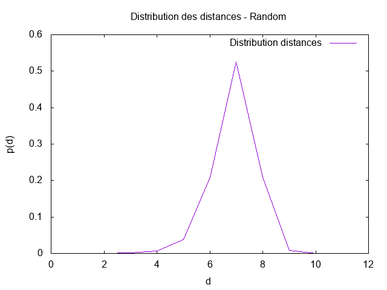

# TP Mesures sur les réseaux d'intéraction

***

# Rapport de BOURGEAUX Maxence, Groupe 1 Master IWOCS

***

## Introduction

Le but de ce TP est d'utiliser GraphStream afin d'analyser différents résultats comme la distribution des degrés, la
distance moyenne ...  d'un réseau de collaboration scientifique en informatique. Ce réseau est extrait de SNAP et 
disponible via le fichier com-dblp.ungraph.txt situé dans src/main/resources. Nous allons ensuite comparer ces résultats
avec ceux obtenus via un générateur de graphe aléatoire et un générateur de graphe Barabasi-Albert.

***

## Question 2. Prenez quelques mesures de base: nombre de nœuds et de liens, degré moyen, coefficient de clustering.

L'utilisation de méthodes déjà implémentées par GraphStream nous permet de prendre quelques mesures de base:
* Nombre de nœuds: 317 080
* Nombre de liens: 1 049 866
* Degré moyen: 6.62208890914917
* Coefficient de clustering: 0.6324308280637396

## Quel sera le coefficient de clustering pour un réseau aléatoire de la même taille et du même degré moyen ?

Voici la formule pour calculer le coefficient de clustering pour un réseau aléatoire:


Ce qui nous donne p = 6.62208890914917 / 317 080 = 2,0884599814397533745427021571843E-5, c'est-à-dire environ 
0.0000209.

***

## Question 3. Le réseau est-il connexe ?

Avec la méthode isConnected() de GraphStream, on peut facilement savoir si un réseau est connexe ou non. Le résultat obtenu
nous retourne true, il est donc bien connexe.

## Un réseau aléatoire de la même taille et degré moyen sera-t-il connexe ?

Pour trouver si un réseau aléatoire de la même taille et degré moyen est connexe, on utilise la formule suivante:  


D'où ln(317 080) = 12.67. 

Donc un réseau aléatoire de la même taille et degré moyen n'est pas connexe.

## À partir de quel degré moyen un réseau aléatoire avec cette taille devient connexe ?

Un réseau aléatoire devient donc connexe à partir d'un degré moyen supérieur ou égal à 12.67, ce qui correspond quasiment
au double du degré moyen de notre graphe.

***

## Question 4. Calculez la distribution des degrés et tracez-la avec gnuplot (ou avec votre outil préféré) d'abord en échelle linéaire, ensuite en échelle log-log.

La distribution des degrés se calcule avec la formule suivante: 


Ce qui nous donne le code suivant:

```java
public void degreeDistribution(String nameFile) {
    setNameFile(nameFile);
    StringBuilder stringBuilder = new StringBuilder();
    int[] p = Toolkit.degreeDistribution(getGraph());

    for(int k = 0; k < p.length; k++)
        if (p[k] != 0)
            stringBuilder.append(String.format("%6d%20.8f%n", k, ((double) p[k] / getNode())));
        Utils.saveFile(getNameFile(), stringBuilder.toString());
}
```

Via Gnuplot, on obtient ce graphique en échelle linéaire:


On remarque que ce n'est pas très parlant.

## Est-ce qu'on observe une ligne droite en log-log ?

Voici la version en échelle log-log:


## Tracez la distribution de Poisson avec la même moyenne pour comparaison. Utilisez la commande fit de gnuplot pour trouver les coefficients de la loi de puissance et tracez-la.

Enfin, voici la distribution des degrés avec la loi de Poisson et la loi de Puissance:


On peut très facilement remarquer que la distribution des degrés tend à suivre la loi de Puissance.

***

## Question 5. Maintenant on va calculer la distance moyenne dans le réseau. On va estimer la distance moyenne par échantillonnage en faisant un parcours en largeur à partir de 1000 sommets choisis au hasard.

Voici la formule du calcul de la distance moyenne dans un réseau:


En prenant 1000 sommets aléatoirement, on obtient les résultats suivants selon le type de graphe (collaboration, aléatoire
et barabasi):


## L'hypothèse des six degrés de séparation se confirme-t-elle ? Est-ce qu'il s'agit d'un réseau petit monde ? 

L'hypothèse des six degrés de séparation est que toute personne sur le globe peut être reliée à n'importe quelle autre, 
au travers d'une chaîne de relations individuelles comprenant au plus six maillons. Ici, nous obtenons une distance moyenne
de 0.21408335120474328. L'hypothèse est donc confirmée. Il s'agit bien d'un réseau petit monde.

## Quelle sera la distance moyenne dans un réseau aléatoire avec les mêmes caractéristiques ? 

Comme vu dans l'image juste au-dessus sur les distances moyennes, pour un réseau aléatoire nous obtenons un distance moyenne
égale à 6.8841640563895545, et pour un réseau de type Barabasi une distance moyenne de 5.031721614759915.

De plus, la distance maximale est aussi une bonne aproximation de la distance moyenne dans le cas des réseaux aléatoires.
Sa formule est:


D'où, pour un réseau aléatoire: ln(317 073) / ln(6.62208890914917) = 6.70060014061

Le calcul de la distance maximale confirme l'hypothèse des six degrés de séparation pour un graphe aléatoire, et il s'agit
bien d'un réseau petit monde (même si l'on se rapproche plus de 7 que de 6, auquel cas ce n'est pas
petit monde).

Pour un réseau de type Barabasi: ln(317 075) / ln(7.005654811859131) = 6.5067954755
Le calcul de la distance maximale confirme l'hypothèse des six degrés de séparation pour un graphe de type Barabsi, et 
il s'agit bien d'un réseau petit monde ici aussi (même si l'on se rapproche plus de 7 que de 6, auquel cas ce n'est pas 
petit monde).

## Tracez également la distribution des distances. 

Voici les différents graphiques de la distribution des distances, selon le type de graphes.





## Formulez une hypothèse sur la loi de cette distribution.

La loi de distribution des distances se rapproche, dans la forme, d'une loi de Poisson.

***

## Question 6. Refaites les mesures des questions précédentes pour ces deux réseaux.

Voici les résultats obtenus pour les deux autres types de réseau:


Les résultats obtenus correspondent aux prédictions théoriques. Nous allons les comparer avec ceux du réseau de collaboration.

* **Nombre de nœuds**

Pour les trois graphes, le nombre nombre de nœuds est similaire → environ 317 000.

* **Nombre de liens**

De même pour les liens, les trois graphes possèdent environ le même nombre → environ 105 000 (avec un léger plus pour 
le graphe de type Barabasi).

* **Degré moyen et connexité**

Les trois graphes possèdent un degré moyen compris entre 6.6 et 7. Comme vu précédemment, le graphe issu du réseau aléatoire
n'est pas connexe car il possède un degré moyen inférieur à 12.67. Le graphe de type Barabasi est quant à lui connexe grâce
à la façon dont il est créé.

* **Coefficient de clustering**

Les trois graphes possèdent un coefficient de clustering similaire → environ 0.000021.

Cependant, le coefficient de clustering d'un noeud est totalement différent pour chaque graphe:
- Collaboration → environ 0.63
- Aléatoire → environ 0.000023
- Barabasi → environ 0.00035

* **Distribution des degrés**

Voici la distribution des degrés d'un réseau aléatoire, puis d'un réseau de type Barabasi:


On a précédemment vu que la distribution des dégrés de notre réseau de collaboration suivait la loi de Puissance.
Ici, on peut remarquer que pour un réseau aléatoire, la distribution des dégrés suit parfaitement la loi de Poisson.

Pour un réseau de type Barabasi, la distribution des degrés tend à suivre plus ou moins la loi de Puissance, comme pour 
notre réseau de collaboration.

* **Distribution des distances**

Les graphiques de la distribution des distances ont été affiché lors de la question précédente. Si nous allons les revoir, 
nous pouvons remarquer que la distribution est plutot similaire entre un réseau aléatoire et un réseau de type barabasi.

Pour notre réseau de collaboration, cette distribution est totalement différente et tend à suivre légèrement la loi de 
Poisson.