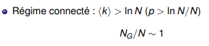
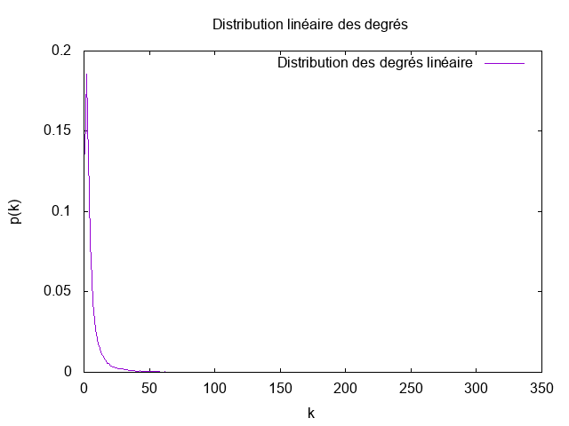
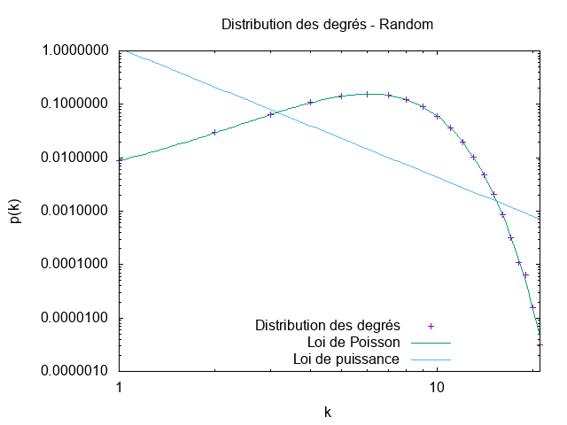
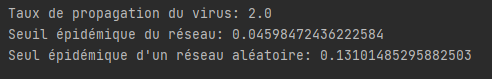
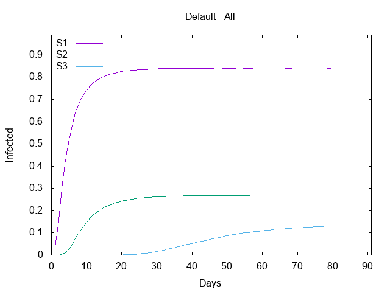
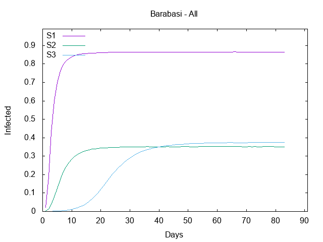

# TP Mesures sur les réseaux d'intéraction

***

# Rapport de BOURGEAUX Maxence, Groupe 1 Master IWOCS

***

## Introduction

Le but de ce TP est d'utiliser GraphStream afin d'analyser différents résultats comme la distribution des degrés, la
distance moyenne ...  d'un réseau de collaboration scientifique en informatique. Ce réseau est extrait de SNAP et 
disponible via le fichier com-dblp.ungraph.txt situé dans src/main/resources. Nous allons ensuite comparer ces résultats
avec ceux obtenus via un générateur de graphe aléatoire et un générateur de graphe Barabasi-Albert.

***

## Question 2. Prenez quelques mesures de base: nombre de nœuds et de liens, degré moyen, coefficient de clustering.

L'utilisation de méthodes déjà implémentées par GraphStream nous permet de prendre quelques mesures de base:
* Nombre de nœuds: 317 080
* Nombre de liens: 1 049 866
* Degré moyen: 6.62208890914917
* Coefficient de clustering: 0.6324308280637396

## Quel sera le coefficient de clustering pour un réseau aléatoire de la même taille et du même degré moyen ?

Voici la formule pour calculer le coefficient de clustering pour un réseau aléatoire:


Ce qui nous donne p = 6.62208890914917 / 317 080 = 2,0884599814397533745427021571843E-5, c'est-à-dire environ 
0.0000209.

***

## Question 3. Le réseau est-il connexe ?

Avec la méthode isConnected() de GraphStream, on peut facilement savoir si un réseau est connexe ou non. Le résultat obtenu
nous retourne true, il est donc bien connexe.

## Un réseau aléatoire de la même taille et degré moyen sera-t-il connexe ?

Pour trouver si un réseau aléatoire de la même taille et degré moyen est connexe, on utilise la formule suivante:  



D'où ln(317 080) = 12.67. 

Donc un réseau aléatoire de la même taille et degré moyen n'est pas connexe.

## À partir de quel degré moyen un réseau aléatoire avec cette taille devient connexe ?

Un réseau aléatoire devient donc connexe à partir d'un degré moyen supérieur ou égal à 12.67, ce qui correspond quasiment
au double du degré moyen de notre graphe.

***

## Question 4. Calculez la distribution des degrés et tracez-la avec gnuplot (ou avec votre outil préféré) d'abord en échelle linéaire, ensuite en échelle log-log.

La distribution des degrés se calcule avec la formule suivante: 


Ce qui nous donne le code suivant:

```java
public void degreeDistribution(String nameFile) {
    setNameFile(nameFile);
    StringBuilder stringBuilder = new StringBuilder();
    int[] p = Toolkit.degreeDistribution(getGraph());

    for(int k = 0; k < p.length; k++)
        if (p[k] != 0)
            stringBuilder.append(String.format("%6d%20.8f%n", k, ((double) p[k] / getNode())));
        RI_package.Utils.saveFile(getNameFile(), stringBuilder.toString());
}
```

Via Gnuplot, on obtient ce graphique en échelle linéaire:



On remarque que ce n'est pas très parlant.

## Est-ce qu'on observe une ligne droite en log-log ?

Voici la version en échelle log-log:


## Tracez la distribution de Poisson avec la même moyenne pour comparaison. Utilisez la commande fit de gnuplot pour trouver les coefficients de la loi de puissance et tracez-la.

Enfin, voici la distribution des degrés avec la loi de Poisson et la loi de Puissance:


On peut très facilement remarquer que la distribution des degrés tend à suivre la loi de Puissance.

***

## Question 5. Maintenant on va calculer la distance moyenne dans le réseau. On va estimer la distance moyenne par échantillonnage en faisant un parcours en largeur à partir de 1000 sommets choisis au hasard.

Voici la formule du calcul de la distance moyenne dans un réseau:


En prenant 1000 sommets aléatoirement, on obtient les résultats suivants selon le type de graphe (collaboration, aléatoire
et barabasi):


## L'hypothèse des six degrés de séparation se confirme-t-elle ? Est-ce qu'il s'agit d'un réseau petit monde ? 

L'hypothèse des six degrés de séparation est que toute personne sur le globe peut être reliée à n'importe quelle autre, 
au travers d'une chaîne de relations individuelles comprenant au plus six maillons. Ici, nous obtenons une distance moyenne
de 0.21408335120474328. L'hypothèse est donc confirmée. Il s'agit bien d'un réseau petit monde.

## Quelle sera la distance moyenne dans un réseau aléatoire avec les mêmes caractéristiques ? 

Comme vu dans l'image juste au-dessus sur les distances moyennes, pour un réseau aléatoire nous obtenons un distance moyenne
égale à 6.8841640563895545, et pour un réseau de type Barabasi une distance moyenne de 5.031721614759915.

De plus, la distance maximale est aussi une bonne aproximation de la distance moyenne dans le cas des réseaux aléatoires.
Sa formule est:


D'où, pour un réseau aléatoire: ln(317 073) / ln(6.62208890914917) = 6.70060014061

Le calcul de la distance maximale confirme l'hypothèse des six degrés de séparation pour un graphe aléatoire, et il s'agit
bien d'un réseau petit monde (même si l'on se rapproche plus de 7 que de 6, auquel cas ce n'est pas
petit monde).

Pour un réseau de type Barabasi: ln(317 075) / ln(7.005654811859131) = 6.5067954755
Le calcul de la distance maximale confirme l'hypothèse des six degrés de séparation pour un graphe de type Barabsi, et 
il s'agit bien d'un réseau petit monde ici aussi (même si l'on se rapproche plus de 7 que de 6, auquel cas ce n'est pas 
petit monde).

## Tracez également la distribution des distances. 

Voici les différents graphiques de la distribution des distances, selon le type de graphes.


## Formulez une hypothèse sur la loi de cette distribution.

La loi de distribution des distances se rapproche, dans la forme, d'une cloche. Son point culminant (sommet) représente
la valeur du plus grand nombre de nœuds partageant une distance avec un autre nœud.

***

## Question 6. Refaites les mesures des questions précédentes pour ces deux réseaux.

Voici les résultats obtenus pour les deux autres types de réseau:


Les résultats obtenus correspondent aux prédictions théoriques. Nous allons les comparer avec ceux du réseau de collaboration.

* **Nombre de nœuds**

Pour les trois graphes, le nombre de nœuds est similaire → environ 317 000.

* **Nombre de liens**

De même pour les liens, les trois graphes possèdent environ le même nombre → environ 105 000 (avec un léger plus pour 
le graphe de type Barabasi).

* **Degré moyen et connexité**

Les trois graphes possèdent un degré moyen compris entre 6.6 et 7. Comme vu précédemment, le graphe issu du réseau aléatoire
n'est pas connexe car il possède un degré moyen inférieur à 12.67. Le graphe de type Barabasi est quant à lui connexe grâce
à la façon dont il est créé.

* **Coefficient de clustering**

Les trois graphes possèdent un coefficient de clustering similaire → environ 0.000021.

Cependant, le coefficient de clustering d'un nœud est totalement différent pour chaque graphe:
- Collaboration → environ 0.63
- Aléatoire → environ 0.000023
- Barabasi → environ 0.00035

* **Distribution des degrés**

Voici la distribution des degrés d'un réseau aléatoire, puis d'un réseau de type Barabasi-Albert:




On a précédemment vu que la distribution des degrés de notre réseau de collaboration suivait la loi de Puissance.
Ici, on peut remarquer que pour un réseau aléatoire, la distribution des degrés suit parfaitement la loi de Poisson.

Pour un réseau de type Barabasi-Albert, la distribution des degrés tend à suivre plus ou moins la loi de Puissance, comme pour 
notre réseau de collaboration.

* **Distribution des distances**

Les graphiques de la distribution des distances ont été affiché lors de la question précédente. Si nous allons les revoir, 
nous pouvons remarquer que la distribution est plutôt similaire entre un réseau aléatoire et un réseau de type barabasi.

Pour notre réseau de collaboration, cette distribution est totalement différente et tend à suivre légèrement la loi de 
Poisson.

***

## TP Propagation dans des réseaux

***

## Introduction

Ce TP est la suite directe du précédent sur les mesures de réseaux d'intéraction. Ici, on va s'intéresser à la propagation
d'un virus dans les différents types de réseaux étudiés (SNAP, aléatoire et Barasi).

Pour ce TP, la construction et la propagation du virus dans un graphe Barabasi-Albert prend énormément de temps (environ
15 minutes pour les 3 scénarios), contrairement aux deux autres types de graphe.

***

## Question 1. Quel est le taux de propagation du virus ? Quel est le seuil épidémique du réseau ? 

* Le taux de propagation du virus se calcule de la manière suivante:

 avec Beta = 1 / 7 et Mu = 1 / 14.

On obtient 2.0 comme résultat.

* Le seuil épidémique du réseau se calcule de la manière suivante:

 où < k > = 6.62208890914917 et < k² > = 
144.00627601867038.

On obtient 0.04598472436222584.

## Comparez avec le seuil théorique d'un réseau aléatoire du même degré moyen.

Le seuil théorique d'un réseau aléatoire se calcule comme ceci:


On obtient le résultat suivant: 0.13101485295882503.

Les calculs sont vérifiés pendant l'exécution du programme:



***

## Question 2. Pour chacun des trois scénarios, tracez l'évolution de la fraction d'infectés de la population non immunisée. Que peut-on conclure ?

Voici le graphique représentant l'évolution du nombre d'infectés (en pourcentage) selon le nombre de jours (ici 84 jours)
et le scénario:



## Que peut-on conclure ?

L'immunisation aléatoire ne permet pas d'éradiquer le virus, mais permet simplement de ralentir sa propagation. 
C'est tout de même une stratégie efficace puisqu'elle permet de ralentir le virus et de le contenir jusqu'à un certain
point, et donc de diminuer quand même de manière significative le nombre total d'infectés, mais ce n'est pas la meilleure.

L'immunisation sélective quant à elle permet de vraiment entraver la progression du virus (on remarque sur le graphique
que le début de la propagation s'effectue plus tard que dans les autres scénarios). En effet, malgré le fait qu'il
y ait moins de personnes immunisées que dans l'immunisation aléatoire, on peut remarquer que le virus à une progression 
relativement faible et va tendre à stagner au fil du temps. De plus, elle offre des résultats plus intéressants → quasiment
deux fois moins d'infectés que l'immunisation aléatoire.

***

## Pour justifier l'efficacité de l'immunisation sélective, calculez le degré moyen des groupes 0 et 1. 

Voici le degré moyen des groupes 0 et 1:


## Comment expliquez-vous la différence ?

Ces groupes représentent ici le nombre de personnes immunisées (50% de personnes aléatoirement immunisées pour le groupe
0 et 50% de personnes aléatoires ont un de leur voisin immunisé pour le groupe 1). 

La différence de degré moyen est presque x3 entre le groupe 0 et le groupe 1. 

***

## Question 4. Calculez le seuil épidémique du réseau modifié pour chacune des deux stratégies d'immunisation et comparez avec le seuil épidémique du réseau initial.

Voici le seuil épidémique du réseau pour chacune des deux stratégies d'immunisation:


Pour rappel, le seuil épidémique du réseau initial vaut 0.04598472436222584, le taux de propogation vaut 2.0 et plus le 
seuil épidémique sera grand et proche du taux de propagation, plus l'infection aura du mal à se répandre.

On remarque que le seuil épidémique du scénario 2 vaut environ la même chose que celui du scénario initial. 
Cela s'explique par le fait qu'il ne dépend pas du réseau et se calcule avec le degré moyen. Le degré moyen du graphe 
initial étant de 6.622 environ, celui du groupe 1 est d'environ 6.64. Ces deux graphes ont donc un seuil épidémique similaire.

Cependant, le seuil épidémique du scénario 3 est beaucoup plus grand (quasiment x3). On peut expliquer cela par le fait 
qu'un nombre conséquent de hubs ont été retirés du réseau par l'immunisation sélective, ce qui limite énormément la 
propagation du virus (c'est l'effet hubs).


***

## Question 5. Comparez et commentez les résultats.

Voici les résultats obtenus selon les différents scénarios pour un réseau aléatoire et un réseau de type Barabasi-Albert:




Pour chacun des différents graphes, la solution initiale S1 où l'on ne fait rien pour arrêter la propagation nous amène 
toujours au même résultat: entre 80 et 90% environ de la population contaminée en l'espace de quelques jours (entre 5 et
15 selon le graphe). On remarque tout de même que la progression de la contamination pour ce scénario 1 pour un graphe 
de type Random est moins rapide que celle des deux autres.

Pour la solution S2, l'immunisation aléatoire, on observe un taux de contamination compris entre 25 et 40%. Cette solution
est la meilleure pour un graphe qui serait aléatoire, et donne quasiment les mêmes résultats que la solution s3 pour un 
graphe Barabasi.

Enfin, pour la solution s3, l'immunisation sélective, on peut voir que c'est la meilleure solution pour notre graphe de
collaboration, avec des résultats exceptionnels (environ 15% d'infectés seulement !).

Quant au graphe de type Barabasi, comme dit précédemment, cette solution propose des résultats finaux ex aequo avec la 
solution s2. Cependant, dans les trois graphes proposés, l'immunité sélective est celle qui permet de ralentir le plus 
efficacement la propagation du virus (même si parfois le nombre d'infectés final est plus grand que d'autres solutions).
